# Data Visualizations

Examples of what can be achieved through either:
- Configuring a Chart component with Plotly JSON
- Using a custom component

NOTES: 
1. This repo is intended for examples that can be configured entirely within the Retool IDE. It does not include custom components with a complete web bundling process to generate a single js file.
2. Because the JSON may include inline JS, it does not necessarily conform to the JSON spec
3. Because this content is taken straight from the Retool IDE, data and layout javascript objects may not conform to the JSON spec (e.g. unquoted keys)

## Further information

[Technical Webinar: Building Data-Driven Dashboards in Retool](https://www.youtube.com/watch?v=iN5nLpcu2J8&t=683s)

## Configuring a Chart using Plotly.js

Each configuration here contains a screencap of the visualization, and files containing JSON values that can be used

Not all files are present for every vis, but where available they should be used as follows:

### Format A

- __data.json__: add to the Data field in the Chart component (after selecting the Plotly JSON option)
- __layout.json__: add to the Layout field in the Chart component (after selecting the Plotly JSON option)
- __temp_state.json__: create a temp variable to hold this value

### Format B
- __getData.js__: create a getData JS query with the contents of this file. Set the Data option of the Chart component to {{ getData.data }}
- __getLayout.js__: create a getLayout JS query with the contents of this file. Set the Layout option of the Chart component to {{ getLayout.data }}
- __anyOtherFunction.js__: if there are more .js files, add them as JS queries using the same name eg 'anyOtherFunction' in this example

NOTE: if a temp_state.json file is provided, you will need to inspect data.json or layout.json to validate the correct name for the temp variable.

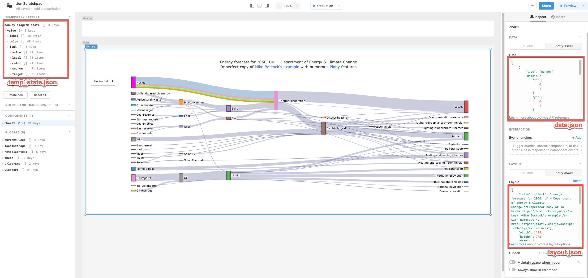

## Plotly.js configurations

[3D Chart](plotly_component/3d_chart/)

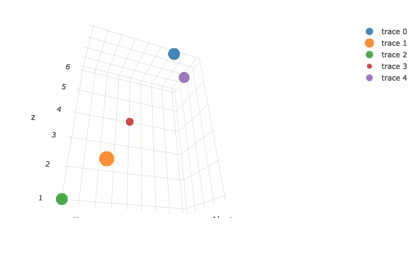
___
[Bubble Chart](plotly_component/bubble_chart/)

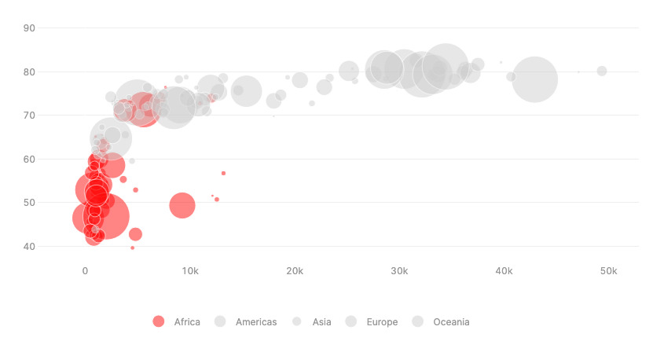
___
[Bubble Chart 2](plotly_component/bubble_chart_2/)

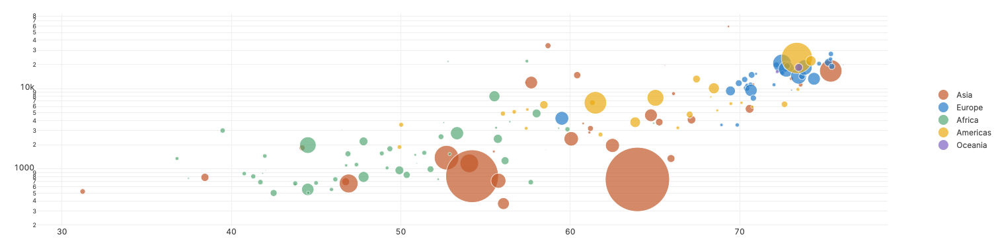
___
[Bullet Chart](plotly_component/bullet_chart/)

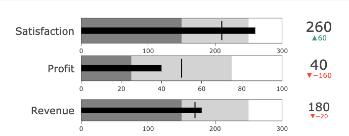
___
[Double Y Axis](plotly_component/double_y_axis/)

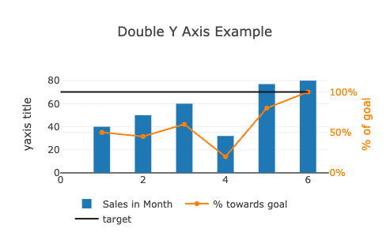
___
[Exploded Pie Chart](plotly_component/exploded_pie_chart/)

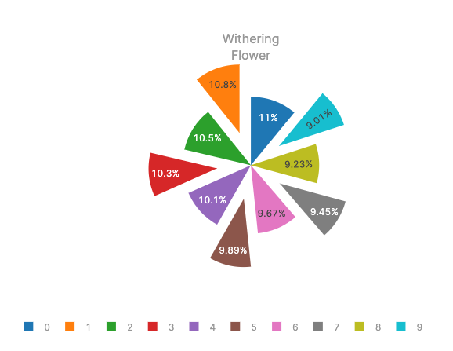
___
[Funnel Chart](plotly_component/funnel_chart/)

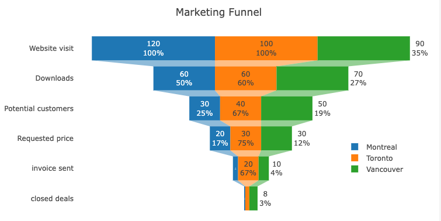
___
[Funnel Chart 2](plotly_component/funnel_chart_2/)

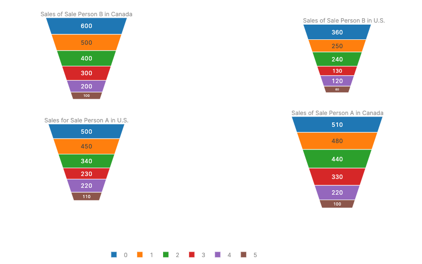
___
[Gauge Chart](plotly_component/gauge_chart/)

___
[Line Chart](plotly_component/line_chart/)

___
[Sankey Diagram](plotly_component/sankey_diagram/)

___
[Scatter Geo](plotly_component/scattergeo/)

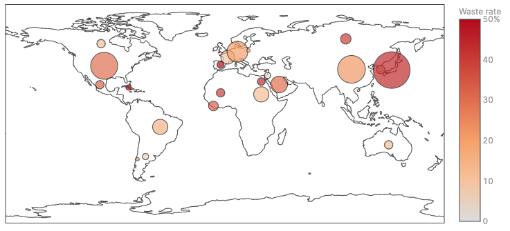
___
[Stacked Bar Chart](plotly_component/stacked_bar_chart/)

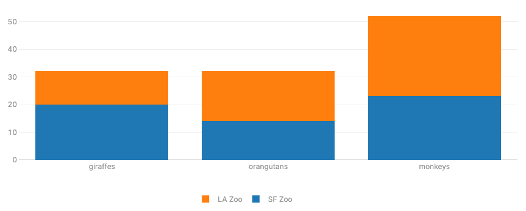
___
[Ternary Chart](plotly_component/ternary_chart/)

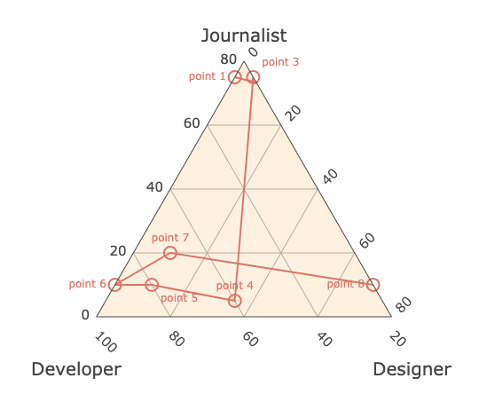
___
[Waterfall Chart](plotly_component/waterfall_chart/)

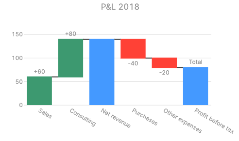
___

## Custom Components

[Sankey Chart](custom_component/sankey_chart/)
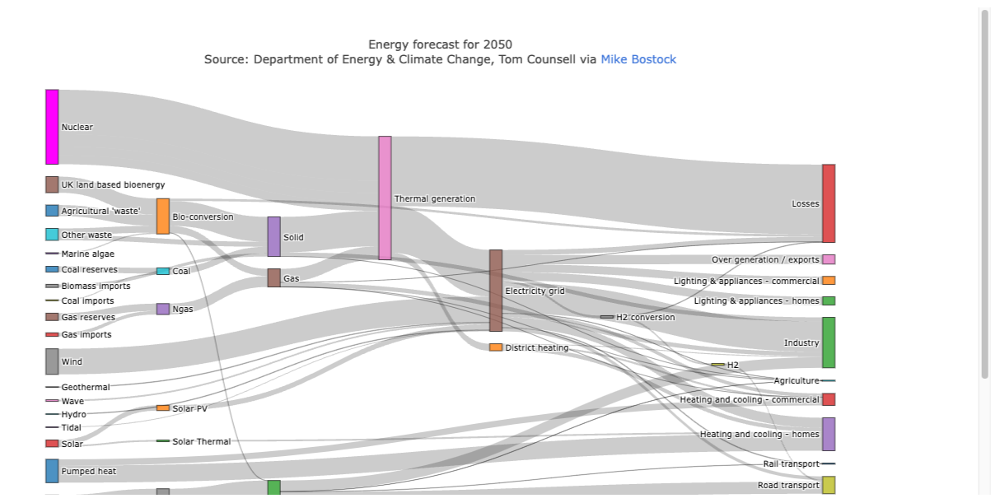
___
[Tree Diagram](custom_component/tree_diagram/)
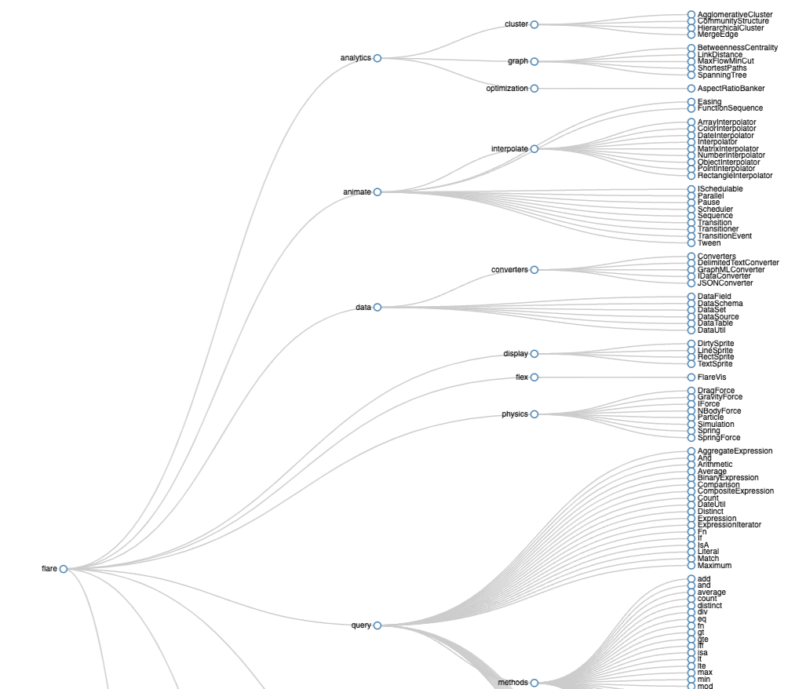
